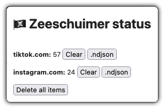

# 🏴‍☠️ Zeeschuimer-F - Real-Time Instagram Stories Capture with Firebase Backend

Zeeschuimer-F is a modified version of the original [Zeeschuimer project](https://github.com/digitalmethodsinitiative/zeeschuimer) designed to capture Instagram Stories data. The project is based on the research and work done by Stijn Peeters for the [Digital Methods Initiative](https://digitalmethods.net).

## Original Zeeschuimer

The original Zeeschuimer is a browser extension that monitors internet traffic while you are browsing a social media site and collects data about the items you see in a platform's web interface for later systematic analysis. It was primarily intended for researchers who wished to systematically study content on social media platforms that resist conventional scraping or API-based data collection. To learn more about the original Zeeschuimer project, see the original [GitHub repository](https://github.com/digitalmethodsinitiative/zeeschuimer).

## Modifications for Real-Time Data Capture and Firebase Backend

Zeeschuimer-F introduces a significant modification by implementing replacing the 4CAT backend with [zeeschuimer-fb-backend](https://github.com/michaelachmann/zeeschuimer-fb-backend), a Firebase backend to instantly save the captured data on a remote server. The extension communicates seamlessly with the Firebase server, enabling efficient and secure storage of real-time captured data for later analysis.

## Future Work

The modified Zeeschuimer-F and [zeeschuimer-fb-backend](https://github.com/michaelachmann/zeeschuimer-fb-backend) have been developed rapidly for a running research project. Everyone can clone the backend and create their own Firebase instance. Future improvements of the project would add user management and a front-end.

## License

Zeeschuimer-F is licensed under the Mozilla Public License Version 2.0. Refer to the [LICENSE](LICENSE) file for more information.

## Credits

Zeeschuimer-F acknowledges the research and development efforts by Stijn Peeters for the original Zeeschuimer project. The modifications made for implementing the real-time data capture mechanism and the Firebase backend were carried out by [Michael Achmann-Denkler](https://go.ur.de/michael-achmann).