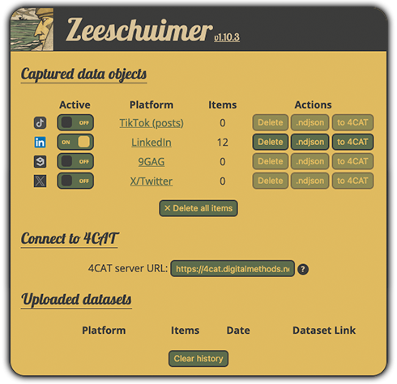

# 🏴‍☠️ Zeeschuimer

Zeeschuimer is a browser extension that monitors internet traffic while you are browsing a social media site, and 
collects data about the items you see in a platform's web interface for later systematic analysis. Its target audience
is researchers who wish to systematically study content on social media platforms that resist conventional scraping or 
API-based data collection.

You can, for example, browse TikTok and later export a list of all posts you saw in the order you saw them in. Data can 
be exported as a JSON file or exported to a [4CAT](https://github.com/digitalmethodsinitiative/4cat) instance for 
analysis and storage. Zeeschuimer is primarily intended as a companion to 4CAT, but you can also integrate its output
into your own analysis pipeline.

Currently, it supports the following platforms:
* [TikTok](https://www.tiktok.com) (posts and comments)
* [Instagram](https://www.instagram.com) (posts only)
* [X/Twitter](https://www.x.com)
* [LinkedIn](https://www.linkedin.com)
* [9gag](https://9gag.com)
* [Imgur](https://imgur.com)
* [Douyin](https://douyin.com)
* [Gab](https://gab.com)

Platform support requires regular maintenance to keep up with changes to the platforms. If something does not work, we
welcome issues and pull requests. See 'Limitations' below for some known limitations to data capture.

The extension does not interfere with your normal browsing and never uploads data automatically, only when you
explicitly ask it to do so. It uses the
[WebRequest](https://developer.mozilla.org/en-US/docs/Mozilla/Add-ons/WebExtensions/API/webRequest) browser API to
locally collect and parse the data search engines are sending to your browser as you use it.

## Installation
Zeeschuimer is in active development. .xpi files that you can use to install it in your browser are available on the 
[releases](https://github.com/digitalmethodsinitiative/zeeschuimer/releases) page. These are signed and can be installed 
in any Firefox-based browser. If you want to run the latest development version instead, you can [do so from the Firefox
debugging console](https://www.youtube.com/watch?v=J7el77F1ckg) after cloning the repository locally.

## How to use
A [guide to using Zeeschuimer and 4CAT](https://tinyurl.com/nmrw-zeeschuimer-tiktok) is available. Basic instructions 
are as follows: 

Install the browser extension in a Firefox browser. A button with the Zeeschuimer logo (a 'Z') will appear in the 
browser toolbar. Click it to open the Zeeschuimer interface. Enable capturing for the sites you want to capture from.

Next, simply browse a supported platform's site. You will see the amount of items detected per platform increase as you 
browse. When you have the items you need, you can export the data as an [ndjson](https://ndjson.org) file, or upload it
to a 4CAT instance where a 4CAT dataset will be created from the uploaded items. You can then run 4CAT's analytical 
processors on the data.

To upload to 4CAT, copy the URL of the website of the 4CAT instance to the "4CAT instance" field at the top of 
Zeeschuimer's interface. You can then use the "to 4CAT" button to create a new 4CAT dataset from the captured data. 
After uploading, Zeeschuimer will show you a link and the ten most recently uploaded datasets are shown at the bottom of
the interface.

Don't forget to reset the data as needed. For example, if you want to create a dataset for a given TikTok hashtag, first
reset the TikTok data in Zeeschuimer, _then_ go to the hashtag's "Explore" page on TikTok, and then upload the dataset
when you've scrolled down enough to be satisfied with the amount of items.

If you find yourself scrolling a lot to collect data, consider using another browser extension to do it for you, for 
example [FoxScroller](https://addons.mozilla.org/en-US/firefox/addon/foxscroller/).

## Limitations

Due to the technical limitations, it may not be possible to collect all items from all 'views' for each supported 
platform. The following limitations are known:

* *Instagram* items that cannot be captured:
  * Stories
  * Posts from the 'Tagged' and 'Reels' tabs on a profile page
  * Posts from the 'Saved' overview of bookmarked posts
  * Posts from the 'For You' feed on the 'Explore' page (the 'Not personalized' feed _does_ work)
  * 'Suggested for you' and 'Sponsored' posts on the front page feed
* *TikTok* items that cannot be captured:
  * Live streams

Note that these are *known* limitations; data capture may break or change based on platform changes. Always 
cross-reference captured data with what you are seeing in your browser.

## Credits & license
Zeeschuimer was developed by Stijn Peeters for the [Digital Methods Initiative](https://digitalmethods.net) and is 
licensed under the Mozilla Public License, 2.0. Refer to the LICENSE file for more information.

Graphics based on [an image generated by Dall-E](https://labs.openai.com/s/oWvGAHC0pxwWV3bNLfENu7AV), for the prompt 
'detail of a 1914 metaphysical painting by giorgio de chirico depicting a buccaneer pensively looking out over the open 
sea'. Interface icons by [Font Awesome](https://fontawesome.com/license/free). 
[Open Sans](https://fonts.google.com/specimen/Open+Sans) and [Lobster](https://fonts.google.com/specimen/Lobster) fonts 
from Google Fonts.

Development is supported by the Dutch [PDI-SSH](https://pdi-ssh.nl/en/) foundation through the [CAT4SMR 
project](https://cat4smr.humanities.uva.nl/).
